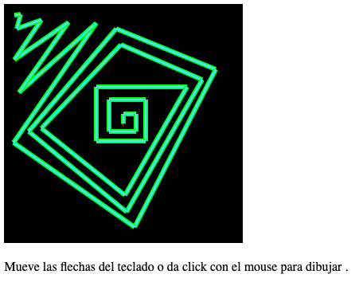

# Teclas

Bienvenido! 👋

Dibujar usando el teclado o el mouse

Podemos hacer que nuestro dibujo reaccione al teclado, primero debemos aprender a detectar eventos del teclado.

Recuerda:

- Un programador divide los grandes problemas en problemas más pequeños.
- Todo manejador de eventos devuelve un objeto con los detalles del evento